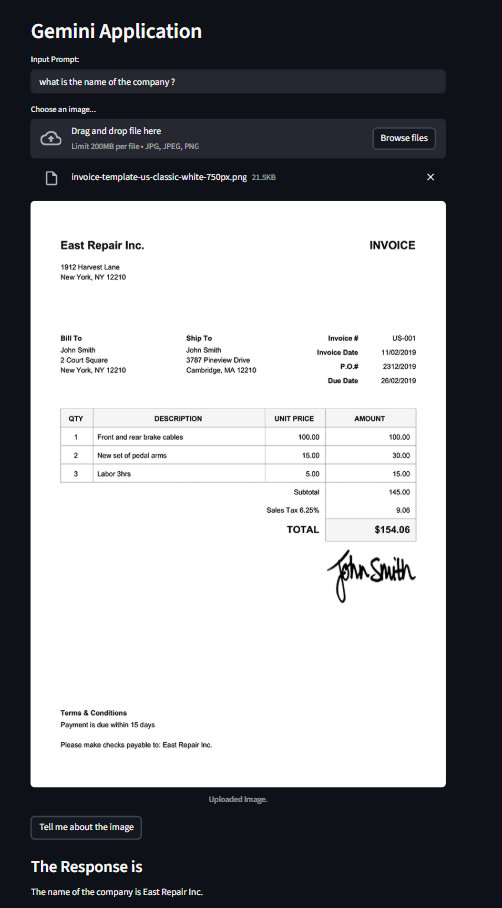
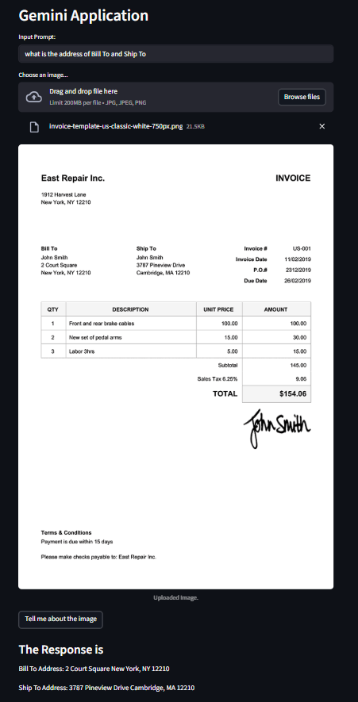
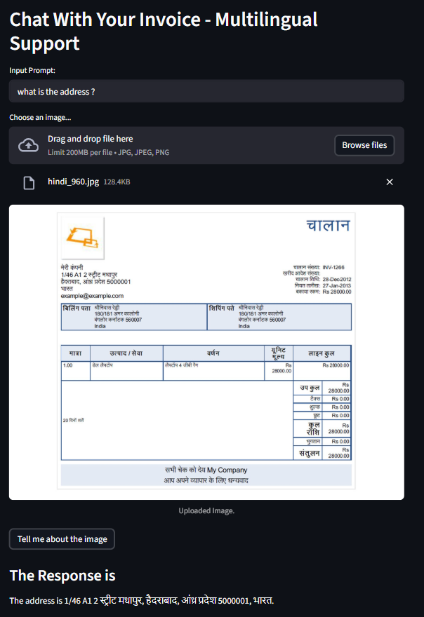

# Invoice Extractor LLM Application

## Overview
An intelligent invoice processing application powered by Google's Gemini 2.0 Flash model that can analyze and extract information from invoice images using advanced computer vision and natural language processing capabilities.

## How It Works
1. Upload an invoice image (JPG, JPEG, PNG)
2. Enter your specific query about the invoice
3. The Gemini AI model processes the image and text prompt
4. Get detailed responses about invoice contents, amounts, dates, vendor information, etc.

## Libraries Used
- **Streamlit** - Web application framework
- **Google Generative AI** - Gemini model integration
- **PIL (Pillow)** - Image processing
- **python-dotenv** - Environment variable management
- **os, pathlib, textwrap** - System utilities

## Getting Gemini API Key
1. Visit [Google AI Studio](https://makersuite.google.com/app/apikey)
2. Sign in with your Google account
3. Click "Create API Key"
4. Copy the generated API key
5. Create a `.env` file in the project root
6. Add: `GOOGLE_API_KEY=your_api_key_here`

## How to Run
```bash
# Install dependencies
pip install streamlit google-generativeai python-dotenv pillow

# Run the application
streamlit run vision.py
```

## Advantages
- **Multilingual Support** - Processes invoices in multiple languages
- **Real-time Processing** - Instant analysis and response
- **User-friendly Interface** - Simple drag-and-drop functionality
- **Accurate Extraction** - Advanced AI model ensures high precision
- **Flexible Queries** - Ask any question about the invoice content
- **No Training Required** - Pre-trained model ready to use

## Project Aim
To build an intelligent document processing system that can:
- Automate invoice data extraction
- Reduce manual data entry errors
- Speed up accounting processes
- Support businesses with multilingual invoice processing
- Provide accessible AI-powered document analysis

## Multilingual Support
The application supports invoice processing in multiple languages including:
- English
- Spanish
- French
- German
- Italian
- Portuguese
- Hindi
- Chinese
- Japanese
- And many more languages supported by Gemini 2.0 Flash

## Screenshots





## Features
- Invoice amount extraction
- Vendor/supplier information
- Date and due date identification
- Line item details
- Tax calculations
- Payment terms analysis
- Custom query processing