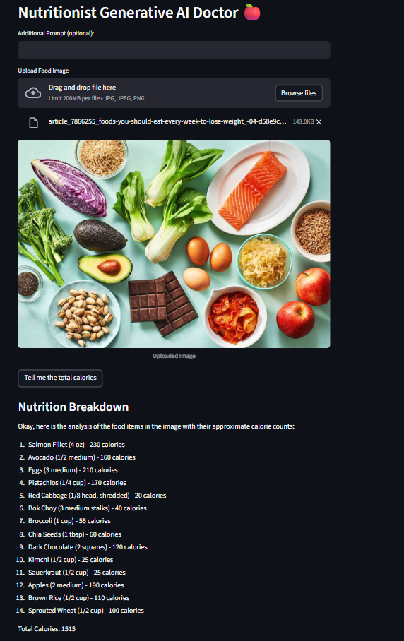
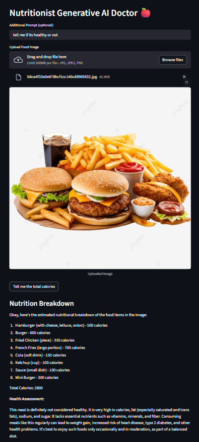
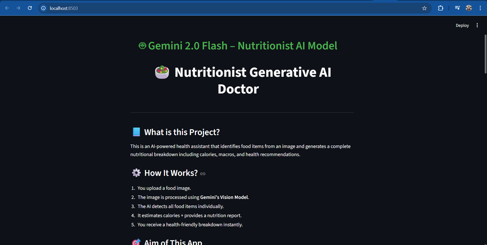
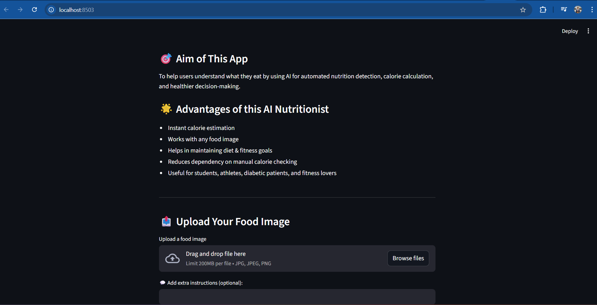

# 🥗 Nutritionist Generative AI Doctor

An AI-powered health assistant that identifies food items from images and generates complete nutritional breakdowns including calories, macros, and health recommendations using Google's Gemini 2.0 Flash Vision Model.

## 📘 What is this Project?

This is an intelligent nutritionist application that leverages Google's Gemini Vision AI to analyze food images and provide instant nutritional information. Simply upload a photo of your meal, and the AI will identify each food item and calculate the approximate calories and nutritional content.

## ⚙️ How It Works

1. **Upload Food Image**: Users upload an image of their meal (JPG, JPEG, PNG formats supported)
2. **AI Vision Processing**: The image is processed using Gemini 2.0 Flash Vision Model
3. **Food Item Detection**: AI identifies and analyzes each food item individually
4. **Nutritional Analysis**: Calculates calories and provides detailed nutrition breakdown
5. **Instant Results**: Users receive comprehensive health-friendly analysis instantly

## 🛠️ Libraries and Technologies Used

- **Streamlit**: Web application framework for the user interface
- **Google Generative AI**: Gemini 2.0 Flash model for vision and text generation
- **PIL (Python Imaging Library)**: Image processing and handling
- **python-dotenv**: Environment variable management
- **os**: Operating system interface for environment variables

## 🔑 Getting Gemini API Key

1. Visit [Google AI Studio](https://makersuite.google.com/app/apikey)
2. Sign in with your Google account
3. Click on "Create API Key"
4. Copy the generated API key
5. Replace `"GOOGLE_API_KEY"` in the `.env` file with your actual API key:
   ```
   GOOGLE_API_KEY = "your_actual_api_key_here"
   ```

## 🚀 How to Run the Code

### Prerequisites
- Python 3.7 or higher
- pip package manager

### Installation Steps

1. **Clone or download the project**
   ```bash
   cd "Project 7 - Nutritionist Generative AI Doctor"
   ```

2. **Install required dependencies**
   ```bash
   pip install -r requirements.txt
   ```

3. **Set up environment variables**
   - Open the `.env` file
   - Replace `"GOOGLE_API_KEY"` with your actual Gemini API key

4. **Run the application**
   ```bash
   streamlit run health.py
   ```

5. **Access the application**
   - Open your web browser
   - Navigate to `http://localhost:8501`
   - Start uploading food images and get nutritional analysis!

## 🌟 Advantages of this AI Nutritionist

- **Instant Calorie Estimation**: Get immediate nutritional information without manual lookup
- **Universal Food Recognition**: Works with any food image from any cuisine
- **Diet & Fitness Support**: Helps maintain diet goals and fitness objectives
- **Time-Saving**: Eliminates need for manual calorie checking and food logging
- **Accessibility**: User-friendly interface suitable for all age groups
- **Health Awareness**: Promotes better understanding of food nutritional content
- **Multi-Purpose**: Useful for students, athletes, diabetic patients, and fitness enthusiasts

## 🎯 Aim to Build

The primary goal of this application is to:

- **Democratize Nutrition Knowledge**: Make nutritional information accessible to everyone
- **Promote Healthy Eating**: Help users make informed dietary decisions
- **Leverage AI for Health**: Utilize cutting-edge AI technology for practical health applications
- **Simplify Nutrition Tracking**: Remove barriers to maintaining a healthy lifestyle
- **Educational Tool**: Serve as a learning platform for understanding food nutrition

## 📸 Application Screenshots

### Main Interface


### Food Image Upload


### AI Analysis Results


### Complete Nutrition Breakdown


## 📁 Project Structure

```
Project 7 - Nutritionist Generative AI Doctor/
├── health.py              # Main Streamlit application
├── test.py               # API key testing script
├── requirements.txt      # Python dependencies
├── .env                 # Environment variables (API key)
├── README.md           # Project documentation
├── image1.png          # Screenshot 1
├── image2.png          # Screenshot 2
├── image3.png          # Screenshot 3
└── image4.png          # Screenshot 4
```

## 🔧 Testing the Setup

Run the test script to verify your API key is working:
```bash
python test.py
```

This will list available Gemini models and confirm your API key is properly configured.

## 🤝 Contributing

Feel free to contribute to this project by:
- Reporting bugs
- Suggesting new features
- Improving the UI/UX
- Adding more nutritional analysis features

## 📄 License

This project is open source and available under the MIT License.

---

**Built with ❤️ using Google Gemini AI and Streamlit**