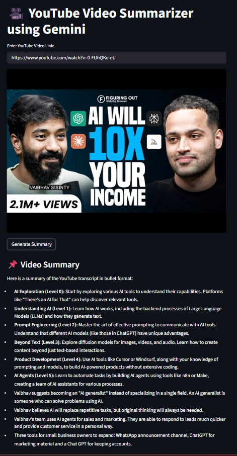
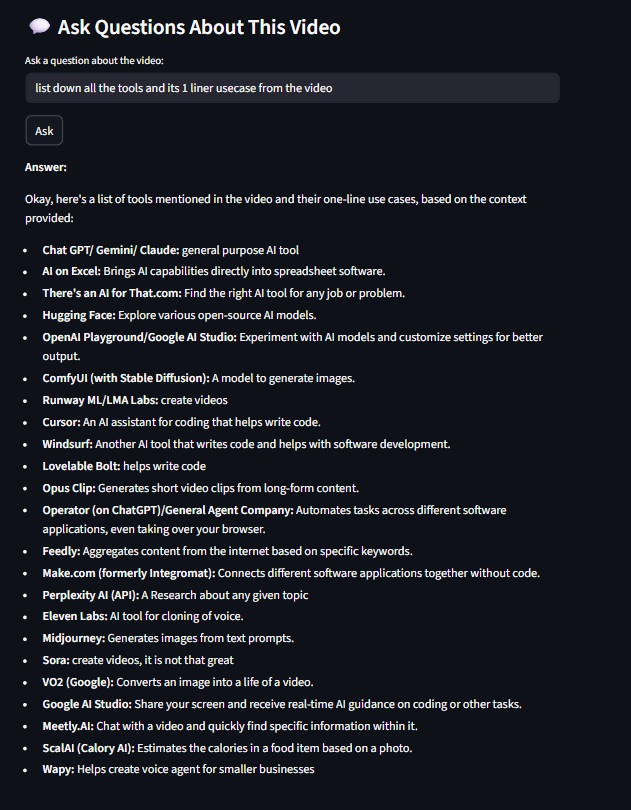

# 🎥 YouTube Video Summarizer using Gemini

A powerful web application that extracts transcripts from YouTube videos and generates intelligent summaries using Google's Gemini AI. Users can also chat with the AI to ask specific questions about the video content.

## ✨ Features

- **Video Transcript Extraction**: Automatically extracts transcripts from YouTube videos
- **Multi-language Support**: Supports English and Hindi transcripts (auto-generated)
- **AI-Powered Summarization**: Uses Google Gemini 2.0 Flash model to generate concise summaries
- **Interactive Chat**: Ask specific questions about the video content
- **Clean UI**: User-friendly Streamlit interface
- **Video Thumbnail Display**: Shows video thumbnail for visual confirmation

## 🛠️ Installation

1. **Clone the repository**
```bash
git clone <repository-url>
cd "Project 8 - YT Video Summarizer"
```

2. **Install required packages**
```bash
pip install streamlit google-generativeai youtube-transcript-api python-dotenv
```

3. **Set up environment variables**
Create a `.env` file in the project directory:
```
GOOGLE_API_KEY=your_google_api_key_here
```

## 🚀 How to Run

1. **Start the application**
```bash
streamlit run app.py
```

2. **Open your browser**
The app will automatically open at `http://localhost:8501`

## 📖 Usage

1. **Enter YouTube URL**: Paste any YouTube video link
2. **Generate Summary**: Click "Generate Summary" to get AI-powered bullet points
3. **Ask Questions**: Use the chat feature to ask specific questions about the video

## 🖼️ Screenshots

### Video Summary Feature



### Interactive Chat Feature


## 🔧 Technical Details

- **Frontend**: Streamlit
- **AI Model**: Google Gemini 2.0 Flash
- **Transcript API**: youtube-transcript-api
- **Languages Supported**: English, Hindi (auto-generated)

## 📋 Requirements

- Python 3.7+
- Google API Key for Gemini
- Internet connection for API calls

## 🤝 Contributing

Feel free to submit issues and enhancement requests!

## 📄 License

This project is open source and available under the MIT License.